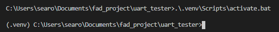

# Description
This tool is used to send packet data to the ESP32 for it to transform with an algorithm.
It includes algorithm selection and data selection capabilities. To run properly,
you must configure it with the correct serial port, which will be of the form "COM5" for Windows
and "dev/tty/usb0" for Linux. Furthermore, the ESP32 must be running the UART_Tester program.

# Running the Program
## Data Setup
To use this tool, first flash the ESP32 program onto the ESP32, called esp_test. There are (or will be)
instructions on how to do that in the readme of the esp_test folder. Once the program is running there,
you can run the **main.py** python file in the uart_tester folder here. Make sure you have the virtual
environment setup first.

For the moment, the signal we send is set through the global at the top of the main file called **DATA_G**,
which by default should be set to 3 seconds of talking. You can instead get song data by using the dt library 
function get_song(time). You have to make sure to format the data correctly, scaling and shifting the values to
 either be an array of 12-bit integer values (e.g. between 0 and 4096) with signal zero corresponding
to an integer value of 2048, or an array of 8-bit integer values (0 and 256) with signal zero corresponding to
an integer value of 128. If you choose the 8 bit values, set the **send_data_byte_size** parameter in the instantiation
to 1, meaning the sent packet values will be just one byte instead of two (8 bit instead of 12-bit with 4 zero bits).

To select the algorithms you want to use, you can use the global at the top called **ALGORITHMS_G**, and the names of 
the available algorithsm are found in the folder **tools** in a file called **consts.py**. To add an algorithm,
you must create the algorithm in C using the template found in the algorithms folder, and you must add the algorithm
to the esp_tests file by adding the 

## Program Start
Once you have selected your data and your algorithms and have flashed and began program to the ESP32, you can start
the python program here. The program will connect to the ESP32 and should start displaying info from the ESP32.
Then, once the bootup process has finished, you can press 'w' to write your selected data to the ESP32. It will take
several presses to complete the process as the program will send the packets in chunks. Once an algorithm has
finished, you can press 's' to save the data to a file, and analyze the data. The program should also display and
play the returned audio to listen to immediately. 

# Setup
To setup your environment, there are some required python packages. Before you install these, make sure
you have pip and python available from your command line. You can find internet resources for help.
Once you can see that pip is running successfully (try typing "pip" in a command line input), you
are ready to set up a virtual python environment. 

> Why the virtual environment? Virtual environments are like little python universes 
where you can install packages and change settings, and it won't
affect other python environments, including the global python environment. This means you can have
one virtual environment for the packages needed for the uart_tester, and you can have another virtual
environment that just has the packages needed for, say, a programming class.

There are many tutorials online for this, but I prefer to use the virtualenv command that comes with
python version 3. Go to a command line and navigate to this folder (can be done easily in vscode by 
typing CTRL+\` {both keys at the same time}) and use the command `python -m venv .venv`. This command will 
setup a virtual environment in a folder called .venv, which is a python setup that you can configure with 
any packages you may need (please don't change the folder name from .venv). If you prefer another 
virtual environment package, just make sure to call the virtual environment folder .venv so the gitignore 
file will still work. 

Once you have the virtual environment ready, you can 'activate' it. This 
process is different depending on your virtual environment, but for venv, you should have an activate 
script located in .venv/Scripts. To activate your virtual environment on a windows computer from the 
parent folder of .venv, type '.\.venv\Scripts\activate.bat' in the command line. You will need
to use a different activate script and command if you have a different operating system. 

If you are using vscode and want it to automatically activate the virtual environment at runtime, 
you must open the command palette (CTRL+SHIFT+p) and search for "Python: Select interpreter". 
Select that option (press 'ENTER' or click it) and choose the python environment with (.venv) 
appended to the end. It should show a file path to a python interpreter inside the .venv folder.

Once you have activated your virtual environment, you should see a little 
(.venv) designation before the command line, as shown in the picture below.

Once here, type the command `pip install -f requirements.txt`. This will install the required
packages located in the requirements.txt file.

If you ever need to add a new package for the uart_tester, first install it with pip e.g.
`pip install [package_name]` then use the command `pip freeze` to write the new package to
the requirements.txt file.